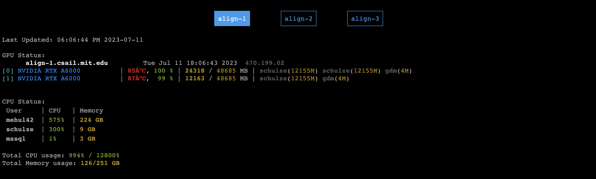

gpustat-web-cis
===========

Custom fork of [gpustat-web](https://github.com/wookayin/gpustat-web). Run with `sh start.sh` and it will
track the gpu status of all servers on the CIS cluster (io2, io4, io6, io51, io52, io55, io56) and store this output in `~/public_html`, making it visible at [http://www.cis.jhu.edu/~sslocum/cluster_status.html](http://www.cis.jhu.edu/~sslocum/cluster_status.html).

Output should look like 

License
-------

MIT License

Copyright (c) 2018-2021 Jongwook Choi
